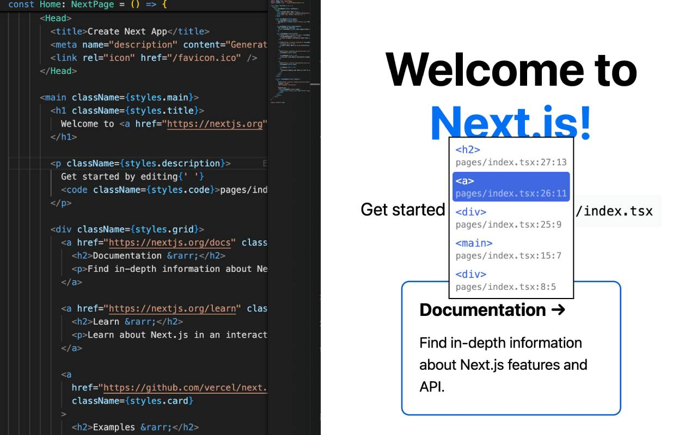
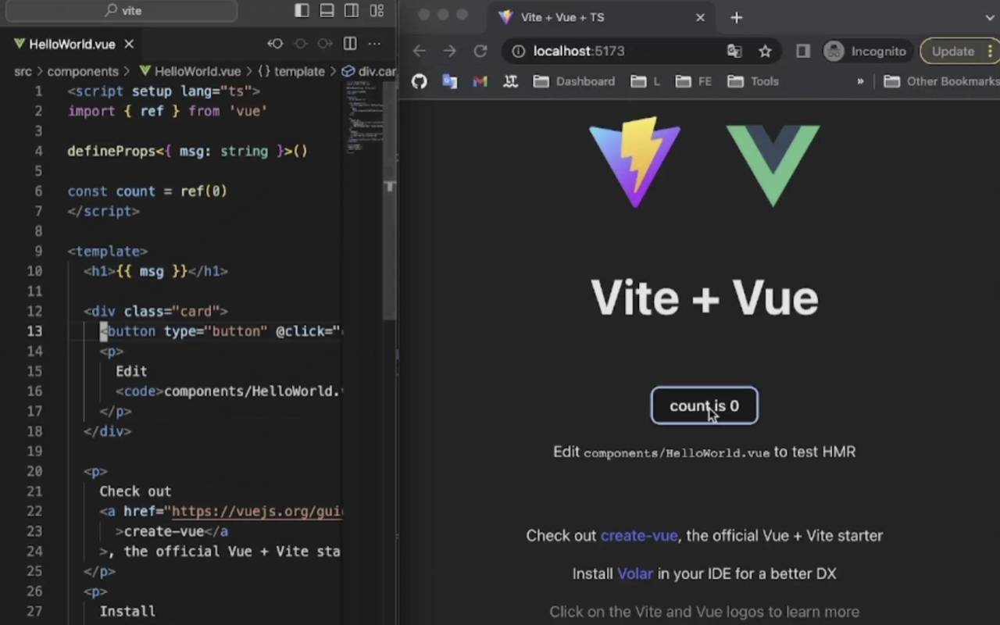
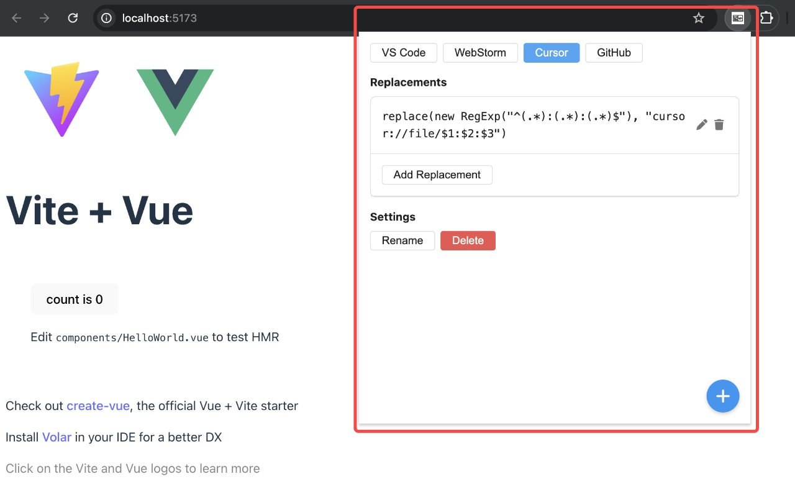

# [click-to-component-browser-extension](https://chromewebstore.google.com/detail/click-to-component/hdiiegojkjkgaakbdjpoaaadhnddpfdc)

English | [简体中文](./README.zh-CN.md)

Option+Click(Alt+Click) a component in your browser to instantly open the source in VS Code.

## Features

1. Option+Click(Alt+Click) a component in your browser to instantly open the source in VS Code.
2. Option+RightClick(Alt+RightClick) opens a context menu with the parent components.
3. Support custom configuration to open WebStorm, Cursor, GitHub, etc.
4. Support `data-__source-code-location`
   - Vue using [vue-click-to-component](https://www.npmjs.com/package/vue-click-to-component) generate.
   - React using [babel-plugin-transform-react-jsx-data-source-code-location](https://www.npmjs.com/package/babel-plugin-transform-react-jsx-data-source-code-location) generate.
5. Support React `__source` (generated by [@babel/plugin-transform-react-jsx-source](https://babeljs.io/docs/babel-plugin-transform-react-jsx-source)).

### React click component to open the code

### Vue click component to open the code

### Customize editor or URL

## Install

1. Open [Click To Component - Chrome Web Store](https://chromewebstore.google.com/detail/hdiiegojkjkgaakbdjpoaaadhnddpfdc);
2. Click `Add to Chrome`;

You can config `Site access` to `On Click` or `On specific sites` for this extension to control click-to-component script inject.
